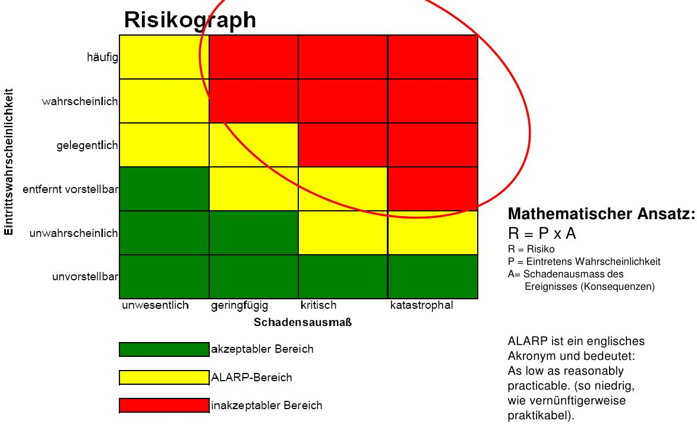

===========================
HS13 PmQm Repetitionsfragen
===========================

Einführung
==========

**1.0.1.**
Erklären Sie das Spannungsfeld erfolgreicher Lösungen.

**1.0.2.**
Erklären Sie den Projektmanagementansatz für erfolgreiche Projekte.

**1.0.3.**
Nennen Sie 9 Schlüsselfähigkeiten für erfolgreiche Projekte.

**1.0.4**
Was ist Tailoring?

Projektmanagement in der Unternehmung
=====================================

**2.0.1.**
Erklären Sie den Organisationswürfel.

**2.0.2.**
Nennen Sie Merkmale eines Projektes

**2.0.3.**
Erklären Sie die drei Unternehmensorganisationsformen.

**2.0.4.**
Welche Folgen hat die Etablierung des Projektmanagements in einer Umternehmung, wenn die Unternehmung

a. Immer gleich Projekte bearbeitet
b. Immer verschiedenartige Projekte bearbeitet

Risiko Management
=================
**3.0.1.**
Was bringt Risikomanagement?

**3.0.2.**
Erklären Sie die Begriffe "Projektrisiko" und "Produktrisiko" und welche Massnahme sie jeweils ergreifen, um dieses zu senken.

**3.0.3.**
Erklären Sie den Risikographen. In welchem Bereich sollten sich ihre Projekte befinden?

**3.0.4.**
Welche Strategien gibt es um das Gesammtrisiko zu vermindern?

**3.0.5.**
Skizzieren Sie den Risiko Management Prozess Circle auf.

**3.0.6.**
Füllen Sie die folgende Liste mit den beiden Elementen des Risiko Managements und ihren Teilaufgaben.

- Risiko ...
	- Risiko ...
	- Risiko ...
	- Risiko ...
- Risiko ...
	- Risiko ...
	- Risiko ...
	- Risiko ...

**3.0.7.**
Wie finden Sie die Risiken in einem Projekt?

**3.0.8.**
Nennen Sie einige Kriterien um Risiken zu bewerten.

**3.0.9.**
Erklären Sie die Folgenden Begriffe der Risiko Einschätzung:

- Kosten der Massnahme
- Maximaler Schaden
- Gewichteter Schaden

**3.0.10.**
Wie gehen Sie bei der Risiko Prioritätenbildung vor?

**3.0.11.**
Nennen Sie einige Risiko Lösungsstrategien.

**3.0.12.**
Wie werden Risiken überwacht?

**3.0.13.**
Listen Sie die sechs Schritte des Risikomanagements mit ihren Techniken auf.

1.
	-
	-
	-
2.
	-
	-
	-
3.
	-
	-
	-
4.
	-
	-
	-
	-
5.
	-
	-
	-
	-
	-
6.
	-
	-
	-
	-

Wirtschaftlichkeitsrechung
==========================
**4.0.1.**
Die Mitarbeiterkosten machen nur etwas gut die Hälfte der Projektkosten aus. Welche weiteren Kosten fallen in einem Projekt noch an? Nennen Sie mindestens 8.

**4.0.2.**
Wie setzt sich der externe Stundensatz eines Mitarbeiters zusammen? Zeigen Sie, wie aus einem Lohn von CHF 9'000.- ein interner Tagesansatz von CHF 950.- und ein externer Tagesansatz von CHF 1040.- resultieren kann.

**4.0.3.**
Was ist die Auslastung eines Mitarbeiters? Wie wirkt sich eine tiefere Auslastung auf den Stundensatz bei gleichbleibenden Kosten aus? Machen Sie ein Beispiel mit 80% und 60% bei dem oben genannten externen Stundenansatz.

**4.0.4.**
Was ist das Ziel einer Kosten-Nutzen Schätzung? Was sind Primär- und Sekundärnutzen? Machen Sie ein Beispiel.

**4.0.5.**
Was ist der ROI? Wann ist er erreicht? Wie verschiebt sich der ROI, wenn die Mitarbeiterkosten höher sind? Wie viel später tritt der ROI ein, wenn das Projekt 6 Monate länger dauert?

Liquidität
----------
**4.1.1.**
Welche Rolle spielt Liquidität für das Überleben der Firma? Welchen Einfluss hat eine Projektverzögerung von 6 Monaten auf die Liquidität und die benötigte Vorfinanzierung?

**4.1.2.**
Erklären Sie die Zahlungsmodalitäten "gestaffelt", "nach Aufwand" und "nach Milestones". Welche ist für sie als Projektleiter am Optimalsten bezüglich Finanzierung?

**4.1.3.**
Warum müssen Sie für ihre Planung die Valuta Daten und nicht das Rechnungsdatum beachten? Was kann passieren, wenn sie dies vergessen?

**4.1.4.**
Welchen Einfluss hat die Kapitalverzinsung auf Liquidität und ROI?

**4.1.5.**
Warum sollten Sie bei der Liquiditäts- und Vorfinanzierungsplanung mindestens 15% Reserve einplanen?

Controlling
===========
**5.0.1.**
Welche Ziele verfolgt das Controlling? Welche Aspekte gehören zum Controlling? Welche Stellung hat ein Controller in einem Projekt.

**5.0.2.**
Wie überwacht das Controlling den Projektstatus?

**5.0.3.**
Was ist ein Steeringcommitee?

**5.0.4.**
Welche Rolle Spielen Entwicklungsstandards? Wie werden Sie entwickelt? Was sollen Sie bringen?

**5.0.5.**
Was wird alles benötigt für ein erfolgreiches und effizientes Controlling?

**5.0.6.**
Was ist ein Bericht- und Kontrollsysteme?

**5.0.7.**
Welche Handlungsmöglichkeiten gibt es, wenn vom Plan abgewichen wird.

**5.0.8.**
Wie funktioniert das Ampel Prinzip?

**5.0.9.**
Wozu dienen Metriken?

**5.0.10.**
Was ist ein Cockpit und wozu dient es?

Scrum
=====
**6.0.1.**
Was ist Scrum? Wie funktioniert es?

**6.0.2.**
Erklären Sie den prädiktiven und den adaptiven Ansatz.

**6.0.3.**
Wie gehen Sie mit Unbekanntem und Risiken in einem Projekt um? Wie solten sich diese während dem Projekt entwickeln?

**6.0.4.**
Erklären Sie die Begriffe "Timeboxing", "Sprints" "Inspect & Adapt" und "Backlog" in Bezug auf Scrum.

ITIL
====
**7.0.1.**
Was ist ITIL?

**7.0.2.**
Welche Ziele hat IT Service Management?

**7.0.3.**
Nennen Sie die wichtigsten drei Erfolgsfaktoren.

**7.0.4.**
Was ist der Service Livecycle und wie funktioniert er?

**7.0.5.**
Erklären Sie folgende Aspekte von ITIL:
- Business Nutzen
- Balance "Qualität - Nutzen - Design"
- Service Nutzen
- Service & Capacity Management
- Availabilit Management
- Continuity Management

**7.0.6.**
Erklären Sie den "Service Transition" Kreislauf.

**7.0.7.**
Wie funktionieren Change- und Release- & Deploy Management?

**7.0.8.**
Welche Aufgaben kommen im Bereich Betrieb & Wartung auf den Projektmanager zu?

Prozessmodelle
==============
**8.0.1.**
Erklären Sie die folgenden Modelle und nennen Sie typische Merkmale sowie Einsatzgebiet:
- Wasserfallmodell
- V-Modell
- Prototypen Modell
- Evolutionäres Modell
- Inkrementelles Modell
- Nebenläufiges Modell
- Objektorientiertes Modell
- Spiral Modell
- Iterative und agile Modelle

Software Development in Real Life
=================================
**7.0.1.**
Warum ist der Termin der Live Schaltung in einem Projekt so wichtig?

**7.0.2.**
Inwiefern läuft ein Projekt nach dem Wasserfallmodell ab, auch wenn innerhalb iterativ gearbeitet wird?

**7.0.3.**
Das Eiserne Dreieck fixiert Scope, Zeit und Budget um die gewünschte Qualität zu erreichen. An welcher Dimension müsste gezerrt werden, wenn das Entwicklungsteam 1 Monat vor Live nicht alle Funktionalität fertigstellen konnte?

**7.0.4.**
Was ist das wertgetriebene Dreieck und wie funktioniert es?

**7.0.5.**
Was bedeutet "Time-boxed" und welche Auswirkungen auf die 2 andern Dimensionen hat es?

**7.0.6.**
Wie sollte üblicherweise mit Changes umgegangen werden? Wie sollten diese in das Projekt einfliessen?

**7.0.7.**
Wie viele Systemumgebungen braucht es für ein vernünftiges Release und Branchmanagement? Warum?

**7.0.8.**
Während das Entwicklungsteam bereits an der Version 1.1 arbeitet, tritt in der Production von 1.0 ein Bug auf. Wie und wo wird der Bug nun gefixt? Zeichnen Sie die Situation mit Balken, die den Betrieb der einzelnen Umgebungen signlisieren.

**7.0.9.**
Warum ist für ein zuverlässiges Releasemanagement Automation dringend notwendig?

**7.0.10.**
Wie helfen Tags und Branches die Automatisierte Entwicklung in Ordnung zu behalten? Skizzieren Sie ein Beispiel.

